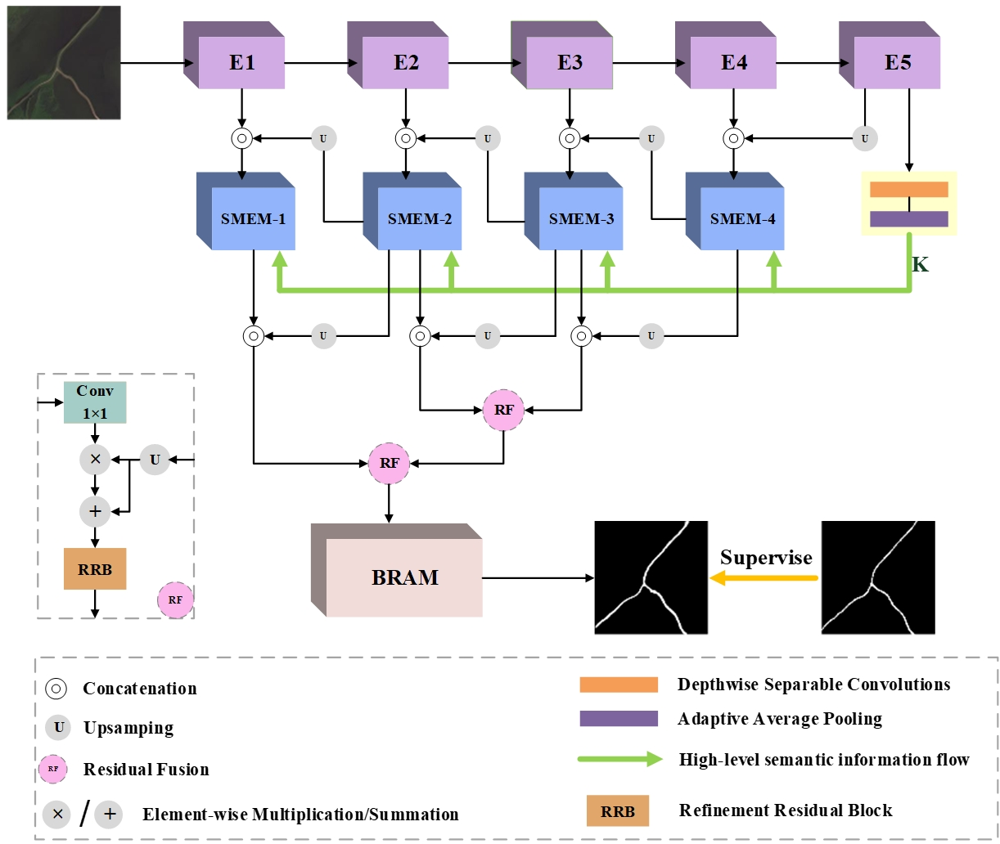

# BMANet  
Bidimensional Multi-scale Attention Network for Salient Object Detection in Remote Sensing Images  
**Lina Huo, Yongmei Wang, Wei Wang**   
# Network Architecture  
  
# Requirements  
Windows 11  
cuda 11.6  
pytorch 1.12.1  
python 3.7.9  
# Datasets  
https://pan.baidu.com/s/1UuYPoC4M8ky0FxgrCSPEow(提取码: 88w8)   
# Saliency maps  
We provide saliency maps of our BMANet on two datasets in './BMANet/Outputs/pred/BMANet/EORSSD' and './BMANet/Outputs/pred/BMANet/ORSSD'.  

We also provide saliency maps of  (code: cebj) on two datasets.  
(images/Qualitative Evaluation.png)    
# Training  
1. Comment out line 64 of run.py like #self.net.load_state_dict......  
2. Comment out line 186 of run.py like #run.test() and ensure that the run.train() statement is executable 
3. python run.py  
# Testing   
1. Put the model weights in ./Checkpoints/trained and ensure that line 64 of run.py is executable
2. Comment out line 185 of run.py like #run.train() and ensure that the run.test() statement is executable
3. python run.py
